# 📦 Tenants

> Auto-generated from [schema-map-postgres.yaml](https://github.com/blackcatacademy/blackcat-database/blob/main/scripts/schema/schema-map-postgres.yaml) (map@sha1:260cf51de6e2c742030665b35b370cdae36de2c6). Do not edit manually.
> Targets: PHP 8.3; MySQL 8.x / MariaDB 10.4; Postgres 15+.

   

        

> 🔥 Lineage hotspot: 24 FK links detected. Make sure cascades/nullability are intentional.

✅ No engine drift detected

> **Schema snapshot**
> Map: [schema-map-postgres.yaml](https://github.com/blackcatacademy/blackcat-database/blob/main/scripts/schema/schema-map-postgres.yaml) · Docs: [docs/definitions.md](docs/definitions.md) · Drift warnings: 0
> Lineage: 0 outbound / 24 inbound · ✅ No engine drift detected · Index coverage: ready · PII flags: 1 · Changelog: fresh

## Quick Links
| What | Link | Notes |
| --- | --- | --- |
| Schema map | [schema-map-postgres.yaml](https://github.com/blackcatacademy/blackcat-database/blob/main/scripts/schema/schema-map-postgres.yaml) | Source for table metadata |
| Pkg folder | [packages/tenants](https://github.com/blackcatacademy/blackcat-database/blob/main/packages/tenants) | Repo location |
| Definitions | [docs/definitions.md](docs/definitions.md) | Column/index/FK docs |
| Engine differences | [docs/definitions.md#engine-differences](docs/definitions.md#engine-differences) | Drift section in definitions |
| Changelog | [CHANGELOG.md](CHANGELOG.md) | Recent changes |

```mermaid
graph LR
  %% Neon lineage view (auto-parsed from docs/definitions.md)
  classDef center fill:#0b1021,stroke:#ff6b6b,stroke-width:3px,color:#fefefe;
  classDef link fill:#0a1f33,stroke:#64dfdf,stroke-width:2px,color:#e8f7ff;
  classDef accent fill:#1d1b4c,stroke:#a855f7,stroke-width:2px,color:#f5e1ff;
  classDef inbound fill:#0f172a,stroke:#10b981,stroke-width:2px,color:#e2fcef;
  tenants["tenants"]:::center
  api_keys["api_keys"]:::inbound -->|FK| tenants
  authors["authors"]:::inbound -->|FK| tenants
  book_assets["book_assets"]:::inbound -->|FK| tenants
  books["books"]:::inbound -->|FK| tenants
  cart_items["cart_items"]:::inbound -->|FK| tenants
  carts["carts"]:::inbound -->|FK| tenants
  categories["categories"]:::inbound -->|FK| tenants
  coupon_redemptions["coupon_redemptions"]:::inbound -->|FK| tenants
  coupons["coupons"]:::inbound -->|FK| tenants
  idempotency_keys["idempotency_keys"]:::inbound -->|FK| tenants
  inventory_reservations["inventory_reservations"]:::inbound -->|FK| tenants
  invoices["invoices"]:::inbound -->|FK| tenants
  newsletter_subscribers["newsletter_subscribers"]:::inbound -->|FK| tenants
  notifications["notifications"]:::inbound -->|FK| tenants
  order_item_downloads["order_item_downloads"]:::inbound -->|FK| tenants
  order_items["order_items"]:::inbound -->|FK| tenants
  orders["orders"]:::inbound -->|FK| tenants
  payment_gateway_notifications["payment_gateway_notifications"]:::inbound -->|FK| tenants
  payments["payments"]:::inbound -->|FK| tenants
  rbac_user_permissions["rbac_user_permissions"]:::inbound -->|FK| tenants
  rbac_user_roles["rbac_user_roles"]:::inbound -->|FK| tenants
  refunds["refunds"]:::inbound -->|FK| tenants
  reviews["reviews"]:::inbound -->|FK| tenants
  tenant_domains["tenant_domains"]:::inbound -->|FK| tenants
  linkStyle 0 stroke:#ff6b6b,stroke-width:3px,opacity:0.92;
  linkStyle 1 stroke:#64dfdf,stroke-width:3px,opacity:0.92;
  linkStyle 2 stroke:#a855f7,stroke-width:3px,opacity:0.92;
  linkStyle 3 stroke:#ffd166,stroke-width:3px,opacity:0.92;
  linkStyle 4 stroke:#4ade80,stroke-width:3px,opacity:0.92;
  linkStyle 5 stroke:#ff6b6b,stroke-width:3px,opacity:0.92;
  linkStyle 6 stroke:#64dfdf,stroke-width:3px,opacity:0.92;
  linkStyle 7 stroke:#a855f7,stroke-width:3px,opacity:0.92;
  linkStyle 8 stroke:#ffd166,stroke-width:3px,opacity:0.92;
  linkStyle 9 stroke:#4ade80,stroke-width:3px,opacity:0.92;
  linkStyle 10 stroke:#ff6b6b,stroke-width:3px,opacity:0.92;
  linkStyle 11 stroke:#64dfdf,stroke-width:3px,opacity:0.92;
  linkStyle 12 stroke:#a855f7,stroke-width:3px,opacity:0.92;
  linkStyle 13 stroke:#ffd166,stroke-width:3px,opacity:0.92;
  linkStyle 14 stroke:#4ade80,stroke-width:3px,opacity:0.92;
  linkStyle 15 stroke:#ff6b6b,stroke-width:3px,opacity:0.92;
  linkStyle 16 stroke:#64dfdf,stroke-width:3px,opacity:0.92;
  linkStyle 17 stroke:#a855f7,stroke-width:3px,opacity:0.92;
  linkStyle 18 stroke:#ffd166,stroke-width:3px,opacity:0.92;
  linkStyle 19 stroke:#4ade80,stroke-width:3px,opacity:0.92;
  linkStyle 20 stroke:#ff6b6b,stroke-width:3px,opacity:0.92;
  linkStyle 21 stroke:#64dfdf,stroke-width:3px,opacity:0.92;
  linkStyle 22 stroke:#a855f7,stroke-width:3px,opacity:0.92;
  linkStyle 23 stroke:#ffd166,stroke-width:3px,opacity:0.92;
```

## Contents
| Section | Purpose |
| --- | --- |
| [Quick Links](#quick-links) | Jump to definitions/changelog/tooling |
| [At a Glance](#at-a-glance) | Key counts (columns/indexes/views) |
| [Summary](#summary) | Compact status matrix for this package |
| [Relationship Graph](#relationship-graph) | FK lineage snapshot |
| [Engine Matrix](#engine-matrix) | MySQL/Postgres coverage |
| [Engine Drift](#engine-drift) | Cross-engine diffs |
| [Constraints Snapshot](#constraints-snapshot) | Defaults/enums/checks |
| [Compliance Notes](#compliance-notes) | PII/secret hints |
| [Schema Files](#schema-files) | Scripts by engine |
| [Views](#views) | View definitions |
| [Seeds](#seeds) | Fixtures/smoke data |
| [Usage](#usage) | Runnable commands |
| [Quality Gates](#quality-gates) | Readiness checklist |
| [Regeneration](#regeneration) | Rebuild docs/readme |

## At a Glance
| Metric | Count |
| --- | --- |
| Columns | **12** |
| Indexes | **3** |
| Foreign keys | **0** |
| Unique keys | **3** |
| Outbound links (FK targets) | **0** |
| Inbound links (tables depending on this) | **24** |
| Views | **4** |
| Seeds | **0** |
| Drift warnings | **0** |
| PII flags | **1** |

## Summary
| Item | Value |
| --- | --- |
| Table | tenants |
| Schema files | **7** |
| Views | **2** |
| Seeds | **0** |
| Docs | **present** |
| Changelog | **present** |
| Changelog freshness | fresh (threshold 45 d) |
| Lineage | outbound **0** / inbound **24** |
| Index coverage | **ready** |
| Engine targets | PHP 8.3; MySQL/MariaDB/Postgres |

## Relationship Graph
> ⚡ Neon FK map below is parsed straight from docs/definitions.md for quick orientation.


- Outbound (depends on): _none_
- Inbound (relies on this): "api_keys", "authors", "book_assets", "books", "cart_items", "carts", "categories", "coupon_redemptions", "coupons", "idempotency_keys", "inventory_reservations", "invoices", "newsletter_subscribers", "notifications", "order_item_downloads", "order_items", "orders", "payment_gateway_notifications", "payments", "rbac_user_permissions", "rbac_user_roles", "refunds", "reviews", "tenant_domains"
- Legend: central node = this table, teal/purple arrows = outbound FK targets, green arrows = inbound FK sources.

## Engine Matrix
| Engine | Support |
| --- | --- |
| mysql | ✅ schema(3)<br/>✅ views(1)<br/>⚠️ seeds |
| postgres | ✅ schema(3)<br/>✅ views(1)<br/>⚠️ seeds |

## Engine Drift
_No engine differences detected._

## Constraints Snapshot
- `status` – default=active, enum
- `created_at` – default=CURRENT_TIMESTAMP(6)
- `updated_at` – default=CURRENT_TIMESTAMP(6)
- `version` – default=0

## Schema Files
| File | Engine |
| --- | --- |
| [001_table.mysql.sql](schema/001_table.mysql.sql) | mysql |
| [001_table.postgres.sql](schema/001_table.postgres.sql) | postgres |
| [020_indexes.mysql.sql](schema/020_indexes.mysql.sql) | mysql |
| [020_indexes.postgres.sql](schema/020_indexes.postgres.sql) | postgres |
| [040_views.mysql.sql](schema/040_views.mysql.sql) | mysql |
| [040_views.postgres.sql](schema/040_views.postgres.sql) | postgres |
| [encryption-map.json](schema/encryption-map.json) |  |

## Views
| File | Engine | Source |
| --- | --- | --- |
| [040_views.mysql.sql](schema/040_views.mysql.sql) | mysql | package |
| [040_views.postgres.sql](schema/040_views.postgres.sql) | postgres | package |

## Seeds
_No seed files found._

## Compliance Notes
> ⚠️ Potential PII/secret fields – review retention/encryption policies:
- id (key)

## Usage
```bash
# Install/upgrade schema
pwsh -NoLogo -NoProfile -File scripts/schema-tools/Migrate-DryRun.ps1 -Package tenants -Apply
# Split schema to packages
pwsh -NoLogo -NoProfile -File scripts/schema-tools/Split-SchemaToPackages.ps1
# Generate PHP DTO/Repo from schema
pwsh -NoLogo -NoProfile -File scripts/schema-tools/Generate-PhpFromSchema.ps1 -SchemaDir scripts/schema -TemplatesRoot scripts/templates/php -ModulesRoot packages -NameResolution detect -Force
# Validate SQL across packages
pwsh -NoLogo -NoProfile -File scripts/schema-tools/Lint-Sql.ps1 -PackagesDir packages
```

- PHPUnit (full DB matrix):
```bash
BC_DB=mysql vendor/bin/phpunit --configuration tests/phpunit.xml.dist --testsuite "DB Integration"
BC_DB=postgres vendor/bin/phpunit --configuration tests/phpunit.xml.dist --testsuite "DB Integration"
BC_DB=mariadb vendor/bin/phpunit --configuration tests/phpunit.xml.dist --testsuite "DB Integration"
```

## Quality Gates
- [x] Definitions present
- [x] Changelog present
- [x] Changelog fresh
- [x] Index coverage (PK + index)
- [ ] Outbound lineage captured
- [x] Inbound lineage mapped
- [x] ERD renderable (mermaid)
- [ ] Seeds available – add smoke data seeds

## Maintenance Checklist
- [ ] Update schema map and split: Split-SchemaToPackages.ps1
- [ ] Regenerate PHP DTO/Repo: Generate-PhpFromSchema.ps1
- [ ] Rebuild definitions + README + docs index
- [ ] Ensure seeds/smoke data are present (if applicable)
- [ ] Lint SQL + run full PHPUnit DB matrix

## Regeneration
```bash
# Rebuild definitions (docs/definitions.md)
pwsh -NoLogo -NoProfile -File scripts/schema-tools/Build-Definitions.ps1 -Force
# Regenerate package READMEs
pwsh -NoLogo -NoProfile -File scripts/docs/New-PackageReadmes.ps1 -Force
# Regenerate docs index
pwsh -NoLogo -NoProfile -File scripts/docs/New-DocsIndex.ps1 -Force
# Regenerate package changelogs
pwsh -NoLogo -NoProfile -File scripts/docs/New-PackageChangelogs.ps1 -Force
```

---
> ⚖️ License: BlackCat Proprietary – detailed terms in [LICENSE](https://github.com/blackcatacademy/blackcat-database/blob/main/LICENSE).
