# 📦 Tenants

> Auto-generated from [schema-map-postgres.yaml](https://github.com/blackcatacademy/blackcat-database/blob/main/scripts/schema/schema-map-postgres.yaml) (map@sha1:5221bb5c65d0fbe010594635f9efb6fc13c307b2). Do not edit manually.
> Targets: PHP 8.3; MySQL 8.x / MariaDB 10.4; Postgres 15+.

   

        

> 🔥 Lineage hotspot: 24 FK links detected. Make sure cascades/nullability are intentional.

✅ No engine drift detected

Schema vibe

Map: <a href='https://github.com/blackcatacademy/blackcat-database/blob/main/scripts/schema/schema-map-postgres.yaml' style='color:#a5b4fc;'>schema-map-postgres.yaml</a> · Docs: <a href='docs/definitions.md'>definitions</a> · Drift warnings: 0

Lineage heat: 0 outbound / 24 inbound · ✅ No engine drift detected · Index coverage: ready · PII: 1 · Changelog: fresh (18 d)

## Quick Links
- Schema map: [schema-map-postgres.yaml](https://github.com/blackcatacademy/blackcat-database/blob/main/scripts/schema/schema-map-postgres.yaml)
- Pkg folder: [packages\tenants](https://github.com/blackcatacademy/blackcat-database/blob/main/packages\tenants)
- Definitions: [docs/definitions.md](docs/definitions.md)
- Engine differences: [docs/definitions.md#engine-differences](docs/definitions.md#engine-differences)
- Changelog: [CHANGELOG.md](CHANGELOG.md)

> ERD preview: auto-rendered from docs/definitions.md (mermaid).

```mermaid
graph LR
  %% Neon lineage view (auto-parsed from docs/definitions.md)
  classDef center fill:#0b1021,stroke:#ff6b6b,stroke-width:3px,color:#fefefe;
  classDef link fill:#0a1f33,stroke:#64dfdf,stroke-width:2px,color:#e8f7ff;
  classDef accent fill:#1d1b4c,stroke:#a855f7,stroke-width:2px,color:#f5e1ff;
  classDef inbound fill:#0f172a,stroke:#10b981,stroke-width:2px,color:#e2fcef;
  tenants["tenants"]:::center
  api_keys["api_keys"]:::inbound -->|FK| tenants
  authors["authors"]:::inbound -->|FK| tenants
  book_assets["book_assets"]:::inbound -->|FK| tenants
  books["books"]:::inbound -->|FK| tenants
  cart_items["cart_items"]:::inbound -->|FK| tenants
  carts["carts"]:::inbound -->|FK| tenants
  categories["categories"]:::inbound -->|FK| tenants
  coupon_redemptions["coupon_redemptions"]:::inbound -->|FK| tenants
  coupons["coupons"]:::inbound -->|FK| tenants
  idempotency_keys["idempotency_keys"]:::inbound -->|FK| tenants
  inventory_reservations["inventory_reservations"]:::inbound -->|FK| tenants
  invoices["invoices"]:::inbound -->|FK| tenants
  newsletter_subscribers["newsletter_subscribers"]:::inbound -->|FK| tenants
  notifications["notifications"]:::inbound -->|FK| tenants
  order_item_downloads["order_item_downloads"]:::inbound -->|FK| tenants
  order_items["order_items"]:::inbound -->|FK| tenants
  orders["orders"]:::inbound -->|FK| tenants
  payment_gateway_notifications["payment_gateway_notifications"]:::inbound -->|FK| tenants
  payments["payments"]:::inbound -->|FK| tenants
  rbac_user_permissions["rbac_user_permissions"]:::inbound -->|FK| tenants
  rbac_user_roles["rbac_user_roles"]:::inbound -->|FK| tenants
  refunds["refunds"]:::inbound -->|FK| tenants
  reviews["reviews"]:::inbound -->|FK| tenants
  tenant_domains["tenant_domains"]:::inbound -->|FK| tenants
  linkStyle 0 stroke:#ff6b6b,stroke-width:3px,opacity:0.92;
  linkStyle 1 stroke:#64dfdf,stroke-width:3px,opacity:0.92;
  linkStyle 2 stroke:#a855f7,stroke-width:3px,opacity:0.92;
  linkStyle 3 stroke:#ffd166,stroke-width:3px,opacity:0.92;
  linkStyle 4 stroke:#4ade80,stroke-width:3px,opacity:0.92;
  linkStyle 5 stroke:#ff6b6b,stroke-width:3px,opacity:0.92;
  linkStyle 6 stroke:#64dfdf,stroke-width:3px,opacity:0.92;
  linkStyle 7 stroke:#a855f7,stroke-width:3px,opacity:0.92;
  linkStyle 8 stroke:#ffd166,stroke-width:3px,opacity:0.92;
  linkStyle 9 stroke:#4ade80,stroke-width:3px,opacity:0.92;
  linkStyle 10 stroke:#ff6b6b,stroke-width:3px,opacity:0.92;
  linkStyle 11 stroke:#64dfdf,stroke-width:3px,opacity:0.92;
  linkStyle 12 stroke:#a855f7,stroke-width:3px,opacity:0.92;
  linkStyle 13 stroke:#ffd166,stroke-width:3px,opacity:0.92;
  linkStyle 14 stroke:#4ade80,stroke-width:3px,opacity:0.92;
  linkStyle 15 stroke:#ff6b6b,stroke-width:3px,opacity:0.92;
  linkStyle 16 stroke:#64dfdf,stroke-width:3px,opacity:0.92;
  linkStyle 17 stroke:#a855f7,stroke-width:3px,opacity:0.92;
  linkStyle 18 stroke:#ffd166,stroke-width:3px,opacity:0.92;
  linkStyle 19 stroke:#4ade80,stroke-width:3px,opacity:0.92;
  linkStyle 20 stroke:#ff6b6b,stroke-width:3px,opacity:0.92;
  linkStyle 21 stroke:#64dfdf,stroke-width:3px,opacity:0.92;
  linkStyle 22 stroke:#a855f7,stroke-width:3px,opacity:0.92;
  linkStyle 23 stroke:#ffd166,stroke-width:3px,opacity:0.92;
```

## Contents
- [Quick Links](#quick-links)
- [At a Glance](#at-a-glance)
- [Summary](#summary)
- [Relationship Graph](#relationship-graph)
- [Engine Matrix](#engine-matrix)
- [Engine Drift](#engine-drift)
- [Constraints Snapshot](#constraints-snapshot)
- [Compliance Notes](#compliance-notes)
- [Schema Files](#schema-files)
- [Views](#views)
- [Seeds](#seeds)
- [Usage](#usage)
- [Quality Gates](#quality-gates)
- [Regeneration](#regeneration)

## At a Glance
| Metric | Count |
| --- | --- |
| Columns | 11 |
| Indexes | 3 |
| Foreign keys | 0 |
| Unique keys | 3 |
| Outbound links (FK targets) | 0 |
| Inbound links (tables depending on this) | 24 |
| Views | 4 |
| Seeds | 0 |
| Drift warnings | 0 |
| PII flags | 1 |

## Summary
- Table: tenants
- Schema files: 6
- Views: 2
- Seeds: 0
- Docs: present
- Changelog: present
- Changelog freshness: fresh (18 days old; threshold 45)
- Outbound FK targets: none
- Inbound FK sources: 24
- Index coverage: ready
- Engine targets: PHP 8.3; MySQL/MariaDB/Postgres

## Relationship Graph
> ⚡ Neon FK map below is parsed straight from docs/definitions.md for quick orientation.

- Outbound (depends on): _none_
- Inbound (relies on this): "api_keys", "authors", "book_assets", "books", "cart_items", "carts", "categories", "coupon_redemptions", "coupons", "idempotency_keys", "inventory_reservations", "invoices", "newsletter_subscribers", "notifications", "order_item_downloads", "order_items", "orders", "payment_gateway_notifications", "payments", "rbac_user_permissions", "rbac_user_roles", "refunds", "reviews", "tenant_domains"
- Legend: central node = this table, teal/purple arrows = outbound FK targets, green arrows = inbound FK sources.

## Engine Matrix
| Engine | Support |
| --- | --- |
| mysql | ✅ schema(3) ✅ views(1) ⚠️ seeds |
| postgres | ✅ schema(3) ✅ views(1) ⚠️ seeds |

## Engine Drift
_No engine differences detected._

## Constraints Snapshot
- `created_at` – default=CURRENT_TIMESTAMP(6)
- `status` – default=active, enum
- `updated_at` – default=CURRENT_TIMESTAMP(6)
- `version` – default=0

## Schema Files
| File | Engine |
| --- | --- |
| [001_table.mysql.sql](schema/001_table.mysql.sql) | mysql |
| [001_table.postgres.sql](schema/001_table.postgres.sql) | postgres |
| [020_indexes.mysql.sql](schema/020_indexes.mysql.sql) | mysql |
| [020_indexes.postgres.sql](schema/020_indexes.postgres.sql) | postgres |
| [040_views.mysql.sql](schema/040_views.mysql.sql) | mysql |
| [040_views.postgres.sql](schema/040_views.postgres.sql) | postgres |

## Views
| File | Engine | Source |
| --- | --- | --- |
| [040_views.mysql.sql](schema/040_views.mysql.sql) | mysql | package |
| [040_views.postgres.sql](schema/040_views.postgres.sql) | postgres | package |

## Seeds
_No seed files found._

## Compliance Notes
> ⚠️ Potential PII/secret fields – review retention/encryption policies:
- id (key)

## Usage
- Install/upgrade schema: pwsh -NoLogo -NoProfile -File scripts/schema-tools/Migrate-DryRun.ps1 -Package tenants -Apply
- Split schema: pwsh -NoLogo -NoProfile -File scripts/schema-tools/Split-SchemaToPackages.ps1
- Generate PHP DTO/Repo: pwsh -NoLogo -NoProfile -File scripts/schema-tools/Generate-PhpFromSchema.ps1 -SchemaDir scripts/schema -TemplatesRoot scripts/templates/php -ModulesRoot packages -NameResolution detect -Force
- Validate SQL: pwsh -NoLogo -NoProfile -File scripts/schema-tools/Lint-Sql.ps1 -PackagesDir packages
- PHPUnit (full DB matrix): set BC_DB=mysql|postgres|mariadb then run `vendor/bin/phpunit --configuration tests/phpunit.xml.dist --testsuite "DB Integration"`

## Quality Gates
[x] Definitions present
[x] Changelog present
[x] Changelog fresh
[x] Index coverage (PK + index)
[ ] Outbound lineage captured
[x] Inbound lineage mapped
[x] ERD renderable (mermaid)
[ ] Seeds available – add smoke data seeds

## Maintenance Checklist
- [ ] Update schema map and split: Split-SchemaToPackages.ps1
- [ ] Regenerate PHP DTO/Repo: Generate-PhpFromSchema.ps1
- [ ] Rebuild definitions + README + docs index
- [ ] Lint SQL + run full PHPUnit DB matrix

## Regeneration
- Definitions: pwsh -NoLogo -NoProfile -File scripts/schema-tools/Build-Definitions.ps1 -Force
- Pkg README: pwsh -NoLogo -NoProfile -File scripts/docs/New-PackageReadmes.ps1 -Force
- Docs index: pwsh -NoLogo -NoProfile -File scripts/docs/New-DocsIndex.ps1 -Force
- Pkg changelog: pwsh -NoLogo -NoProfile -File scripts/docs/New-PackageChangelogs.ps1 -Force

---
Generated by scripts/docs/New-PackageReadmes.ps1 (map@sha1:5221bb5c65d0fbe010594635f9efb6fc13c307b2)
⚖️ License: Proprietary – see [LICENSE](https://github.com/blackcatacademy/blackcat-database/blob/main/LICENSE).
